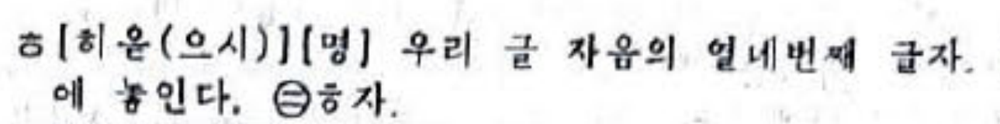

<nav class="page-nav"><a href="01.html">← 発音と音節</a>　<a href="index.html">目次にもどる</a>　<a href="3.html">第3回 →</a></nav>

# 「綴りと発音の不一致」概論

先ほど、

:<: box 

朝鮮語における綴りと発音の不一致の中には

- 音素配列論的制約による自動的なもの
- ある程度「語幹の文字」と「語尾の文字」を分けて表記しつつ、中程度に複雑な体言の曲用と動詞の活用を表現できるようにするための工夫
- 暗記する必要がある語彙的現象

の 3 種類が混ぜこぜになっている

:>:

と話した。

この 3 種類を、どうにかして「十分便利で使いやすい正書法」に落とし込もうという奮闘の結果が朝鮮語の正書法である。
そうして編み出された正書法の上での「連音」「絶音」を理解すれば八割方正しい結果が得られ、それ以外については「予期できない発音変化を起こす現象」としてゴミ箱に乱雑にまとめられている、という設計になっている。

この教材では、文化語において一度は採用された《間の標(사이 표)》という記号を再導入することで、この「予期できない発音変化を起こす現象」の大半を再回収し、「綴りに対して規則を適用することで正しい発音が得られる」範囲を大幅に増やす。

ただし、いずれにせよ「3 つの言語学的現象を、頑張って文字と規則に落とし込もう」としたことによる<b>筋のよい妥協</b>なのであって、

言語現象が先、文字が後

ということをゆめゆめ忘れてはならない。

## コーダ vs. パッチム

前回、このように紹介した。

:<: box

コーダ位置では、摩擦音・破擦音が表れない。
また、口音に存在した平音・激音・濃音の対立が潰れる。この教材では、慣習に合わせて平音の字母を用いて表記するが、archiphoneme であることを明記すべく ⫽ㅂ⫽ などと表記することとする。

<table border="1" cellspacing="0" cellpadding="3" bordercolordark="white" bordercolorlight="black">
  <tbody><tr><td>&nbsp;</td><th>両唇音</th><th>歯茎音</th>
      <th>軟口蓋音</th></tr>
  <tr><th>口音</th>
      <td align="center">⫽ㅂ⫽</td><td align="center">⫽ㄷ⫽</td>
      <td align="center">⫽ㄱ⫽</td>
  <tr><th>鼻音</th>
      <td align="center">⫽ㅁ⫽</td><td align="center">⫽ㄴ⫽</td>
      <td align="center">⫽ㅇ⫽</td>
  <tr><th>流音</th>
      <td align="center">&nbsp;</td><td align="center">⫽ㄹ⫽</td>
      <td align="center">&nbsp;</td>
</tbody></table>

:>:

コーダとは音節にまつわる音韻の話である。

一方で、パッチム (받침) というのは「支える」という動詞の名詞形であり、ハングルの「子音 + 母音」の結合を下から『支える』ように書く字母のことである。

世宗は、コーダを書くことを目的としてパッチムを生み出した。実際、「訓民正音 解例」終声解には以下のような記載がある。

<blockquote class="south">

聲有緩急之殊，故平上去其終聲不類入聲之促急。不清不濁之字，其聲不厲，故用於終則宜於平上去。全清次清全濁之字，其聲為厲，故用於終則宜於入。所以ㆁㄴㅁㅇㄹㅿ六字為平上去聲之終，而余皆為入聲之終也。然ㄱㆁㄷㄴㅂㅁㅅㄹ八字可足用也。如ᄇᆡᆺ곶為梨花，여ᇫ·의갗為狐皮，而ㅅ字可以通用，故只用ㅅ字。

</blockquote>

「花」を表す語はその<b>曲用パラダイムにㅈを含み</b>、「皮」を表す語はその<b>曲用パラダイムにㅊを含む</b>以上、パッチム位置にㅈやㅊを書くような表記も<b>可能性として検討したが</b>、パッチムとして使う文字としてはコーダ位置に当時実際に音声として現れた 8 種類だけで用が足りる（八字可足用也）のだからパッチム位置にㅈやㅊを書くような表記を<b>採用しなかったのだ</b>という設計意図が書かれているのである。

しかしながら。

現代の正書法は、世宗の「八字可足用也」からは<b>最大限舵を切って</b>、コーダが 7 種類しかない言語を表すのに 25 種類ものパッチムを用いているのである。

- ㄱ, ㄳ, ㅋ, ㄲ
- ㄴ, ㄵ, ㄶ
- ㄷ, ㅌ, ㅅ, ㅆ, ㅈ, ㅊ
- ㅂ, ㅍ, ㄼ, ㄿ, ㅄ
- ㄽ, ㄾ, ㅀ
- ㅁ, ㄻ
- ㅇ
- ㅎ 

## まずは具体例：「激音化語幹の用言」

さて、

言語現象が先、文字が後

という抽象論だけ話していても埒が明かない。
激音化用言の活用パラダイムを一旦復習し、
現代の正書法を設計した者がどのようにして言語現象を「文字と規則」に落とし込んだかを見ていこう。

[ㅡ] を用いることがない接辞は、 [ㄱ][ㄴ][ㄷ][ㅁ][ㅈ][ㅆ]または母音のどれかで始まり、

- 口音[ㄱ][ㄷ][ㅈ]で始まる接辞と結合すると、これらを激音化する
- [ㄴ]で始まる接辞と結合するときには、例外的挙動を示す

となるのであった。

<table class="grid w-sm qq" style="font-size: 75%">
<tr>
<td>&nbsp;</td>
<th><small>〜して、</small> [-고]</th>
<th><small>〜する…</small> [-는]</th>
<th><small>〜してたら、</small> [-다가]</th>
<th><small>〜します。</small> [-ㅁ니다]  / [-씀니다]</th>
<th><small>〜します。</small> [-오]  / [-쏘]</th>
<th><small>〜しよう</small> [-자]</th>
<th><small>〜して</small> [-어]  / [-여]  / [-아]</th>
<td></td>
</tr>
<tr class="foo">
<th><small>置く</small> [노-]</th>
<td>[노<b style="color:red">코</b>]</td>
<td>[<b style="color:magenta">논</b>는]</td>
<td>[노<b style="color:red">타</b>가]</td>
<td>[노씀니다]</td>
<td>[노쏘]</td>
<td>[노<b style="color:red">차</b>]</td>
<td>[노아] / [<b style="color:blue; text-decoration:none;">놔</b>]</td>
<th rowspan="3" style="vertical-align:middle;">激音化</th>
</tr>
<tr>
<th><small>〜でない</small> [안-]</th>
<td>[안<b style="color:red">코</b>]</td>
<td>[안는]</td>
<td>[안<b style="color:red">타</b>가]</td>
<td>[안씀니다]</td>
<td>[안쏘]</td>
<td>[안<b style="color:red">차</b>]</td>
<td>[<b style="color:blue; text-decoration:none;">아나</b>]</td>
</tr>
<tr>
<th><small>失う</small> [일-]</th>
<td>[일<b style="color:red">코</b>]</td>
<td>[일<b style="color:magenta">른</b>]</td>
<td>[일<b style="color:red">타</b>가]</td>
<td>[일씀니다]</td>
<td>[일쏘]</td>
<td>[일<b style="color:red">차</b>]</td>
<td>[<b style="color:blue; text-decoration:none;">이러</b>]</td>
</tr>
</table>

ここで、[노<b style="color:red">코</b>]・[안<b style="color:red">코</b>]・[일<b style="color:red">코</b>]という音形を、それぞれ《놓고》・《않고》・《잃고》と<b>表記することとし、</b>

- 母音・リウル語幹に対するこの語尾の音形 [고] と同じ綴りの《고》を토として認定し、
- パッチム位置に埋めておいたㅎが<b>後続する子音を激音にするというマーカー</b>として作用し、《고》という토から [<b style="color:red">코</b>]という音形を作り出す

というルールに<b>しておくと</b>、「語幹の文字」と「語尾（토）の文字」を分けて表記できて便利である。

:<: box

このルールを導入したことで、「口音[ㄱ][ㄷ][ㅈ]で始まり[ㅡ] を用いることがない接辞」と結合するときの激音化語幹について説明が完了した。

[ㅁ]で始まり[ㅡ] を用いることがない接辞は [ㅁ니다]および[ㅁ니까]の 2 種であり、これらは激音化用言では用いられず、代わりに [씀니다]および[씀니까]が用いられる。

ゆえに、残るは[ㄴ]・[ㅆ]・母音である。

:>:

さて、[ㅡ] を用いうる接辞がついたときは、このような挙動を見せるのであった。

<table class="grid w-sm qq" style="font-size: 75%">
<tr>
<td>&nbsp;</td>
<th><small>〜すること</small> [-ㅁ]  / [-음]</th>
<th><small>〜することは</small> [-믄]  / [-으믄]</th>
<th><small>〜すれば</small> [-면]  / [-으면]</th>
<th><small>〜します。</small> [-ㅂ씨다]  / [-읍씨다]</th>
<th><small>〜ので…</small> [-니까]  / [-으니까]</th>
<th><small>〜ください。</small> [-십씨오]  / [-으십씨오]</th>
<td></td>
</tr>
<tr class="foo">
<th><small>置く</small> [노-]</th>
<td>[노음]</td>
<td>[노으믄]</td>
<td>[노으면]</td>
<td>[노읍씨다]</td>
<td>[노으니까]</td>
<td>[노으십씨오]</td>
<th rowspan="3" style="vertical-align:middle;">激音化</th>
</tr>
<tr>
<th><small>〜でない</small> [안-]</th>
<td>[아늠]</td>
<td>[아느믄]</td>
<td>[아느면]</td>
<td>[아늡씨다]</td>
<td>[아느니까]</td>
<td>[아느십씨오]</td>
</tr>
<tr>
<th><small>失う</small> [일-]</th>
<td>[이름]</td>
<td>[이르믄]</td>
<td>[이르면]</td>
<td>[이릅씨다]</td>
<td>[이르니까]</td>
<td>[이르십씨오]</td>
</tr>
</table>

激音化の対象となる子音が直後になく、母音 [ㅡ] によって隔てられているため、特になにも起きない。 
しかしながら、先ほどこれらの用言の語幹を《놓-》・《않-》・《잃-》と書くというルールを定めてしまったからには、
<b>「《놓-》という語幹と《-으면》という토を合わせると[노으면] という音形が生まれる」</b>
という話として解釈する羽目になり、ゆえに「ㅎパッチムは、直後にㅇが来たときには<b><u>消える</u></b>」という捉え方になる。

:<: box

この「消える」規則を導入したことで、母音で始まる [-어] / [-여] / [-아] にも対処できる。
残るは「<b>[ㄴ]および[ㅆ]</b>で始まり[ㅡ] を用いることがない接辞」である。

:>:

[ㅆ]で始まり[ㅡ] を用いることがない接辞は、[씀니다]・[씀니까]・[쏘]の 3 つである。これらは、平音の [ㅅ] として発音されることが全くないにもかかわらず、正書法上《ㅅ》の文字を用いて綴ることと<b>してしまった</b>。ゆえに、これに対処すべく、「ㅎパッチムの直後に《ㅅ》が来たときは、ㅅを激音化することができないので、代わりにㅅを濃音化する」という<b>珍妙な</b>説明がなされる。

最後に、[ㄴ]で始まり[ㅡ] を用いることがない接辞についてだが、たとえば[<b style="color:magenta">논</b>는]・[안는]・[일<b style="color:magenta">른</b>]とふるまう。

TODO: [일<b style="color:magenta">른</b>]については、これは「舌側音化」が起きているのだという解釈を<b>行うことができる</b>。音素配列論としてㄹ+ㄴが登場しないという制約があることに依拠して、「[일<b style="color:magenta">른</b>] という音形も、その制約に依るものである」と主張できるからだ。しかし[<b style="color:magenta">논</b>는]はどうしたものか……？

## 複雑さを「パッチムの綴りと発音規則」に盛り込む

それぞれの曲用タイプ・活用タイプに対して以上のような分析を行い、それを踏まえ<b>ある程度妥協して</b>以下のような「パッチムとその発音方法」といった形へと用言や体言の複雑さを落とし込む。

<blockquote>

朝鮮語で用いるパッチムとその発音は次の通り。

ㄱ, ㄳ, ㅋ, ㄲ: ⫽ㄱ⫽

ただし、《ㄺ》は基本的に⫽ㄱ⫽だけれど動詞･形容詞の語幹末に来た《ㄺ》は《ㄱ》の前で⫽ㄹ⫽

ㄴ, ㄵ, ㄶ: ⫽ㄴ⫽

ㄷ, ㅌ, ㅅ, ㅆ, ㅈ, ㅊ: ⫽ㄷ⫽

ㅂ, ㅍ, ㄼ, ㄿ, ㅄ: ⫽ㅂ⫽

ただし、形容詞語幹末に来た《ㄼ》は《ㄱ》の前で ⫽ㄹ⫽
そして、《여덟》(固有数詞 8)のとき ⫽ㄹ⫽

ㄽ, ㄾ, ㅀ: ⫽ㄹ⫽

ㅁ, ㄻ: ⫽ㅁ⫽

ㅇ: ⫽ㅇ⫽

ㅎ: 「単語の最後の音節と《ㅅ》や《ㄴ》で始まる토(後述)の前で ⫽ㄷ⫽ のように発音する。」……<b>ということになっている。</b>

</blockquote>

:<: b 補足

規定では"無声子音の前と発音が終わるときには…"というようにしているが、省いてしまってもさほど問題がないので今回は簡略化した。
また、ㄼの発音の処理方法が南と異なる。
南では基本を[ㄹ]とし、"밟- は子音の前で[ㅂ]、넓- は派生語･合成語で[ㅂ]と読む"としているため、넓다の発音が異なる。
넓다 北: [넙따] 南: [널따]

:>:

以上の要訣で収まらなかった部分について、これ以降では詳しく見ていこう。

# 「綴りと発音の不一致」もうすこし細かい話

## 濃音化

ひとえに「濃音化」とはいっても、多様な要因に起因する。これらを分けて取り扱うことが極めて重要である。

:<: box

「閉鎖音パッチムの直後であって、そもそも<b>平音と濃音の対立が存在しない</b>」ことを指して呼ぶ「濃音化」

「論理的には ㅆ で綴るべきものを、慣習として ㅅ で綴ることにしてしまったせいで、つじつま合わせで『濃音化』とされるもの
例： -습니다 の頭の子音が ㅅ で発音されることは<b>決してない</b>。

「未来連体形」

直後を必ず濃音化する。中期朝鮮語で ㅭ と書かれていたが、このㆆがハングル創製期に実在子音だったのかどうかは諸説あるらしい。

複合語マーカーとしての、後部要素の<b>語彙的な</b>濃音化

【濃音化語幹】

<small>前に述べたように、【母音・リウル語幹】以外の動詞は直後の接尾辞に平音を許さず、必ず激音か濃音で出現させるという現象がある（この現象をこの形で記述してくれている本が全く見られないことを hsjoihs は腹立たしいと思っている）。この現象に対して、伝統的な教育では様々な場所にこの激音・濃音の説明を散らばらせているが、hsjoihs はむしろ動詞を【母音・リウル語幹】【激音化語幹】【濃音化語幹】の 3 種類に分類したほうが遥かに筋がよいと思っている。</small>

:>:

:<: b 補足

"伝統的な教育では……散らばらせている"というのは、"正書法･発音法等の記述で1項にまとまっていない"ということである。
《文化語発音法》
【第13項】動詞や形容詞の語幹末のパッチム《ㄴ, ㄵ, ㄻ, ㅁ》と《ㄹ》で発音されるパッチム《ㄺ, ㄼ, ㄾ》の後ろに来る토や接尾辞の阻害音は濃音で発音する。
【第14項】 次のような場合に《ㄹ》パッチムの後ろの阻害音は濃音で発音する。
1\) 漢字語で後ろの阻害音が《ㄷ, ㅅ, ㅈ》であるとき
2\) 一部固有語でできた補助的単語が《ㄹ》の後ろに来るとき
3\) 規定토《ㄹ》の後ろに来るとき
【第17項】語幹末のパッチム《ㅎ, ㄶ, ㅀ》の後ろに来る토の阻害音《ㅅ》は濃音で発音する。

というように、個別に対応する形を取っている。
今回、動詞を【母音･リウル語幹】【激音化語幹】【濃音化語幹】の3つに分類する方向をとった。

:>:

｢『閉鎖音パッチムの直後であって、<b>そもそも平音と濃音の対立が存在しない</b>』という意味での『濃音化』｣というのは、いわゆる｢音素配列論(phonotactics)｣である。

<table class="grid w-sm">
<tr>
<td></td>
<td>ㅂ</td>
<td>ㄷ</td>
<td>ㅈ</td>
<td>ㅅ</td>
<td>ㄱ</td>
</tr>
<tr>
<td>⫽ㅂ⫽ + …</td>
<td>[ㅃ]</td>
<td class="blocked"></td>
<td class="blocked"></td>
<td class="blocked"></td>
<td class="blocked"></td>
</tr>
<tr>
<td>⫽ㄷ⫽ + …</td>
<td class="blocked"></td>
<td>[ㄸ]</td>
<td class="blocked"></td>
<td class="blocked"></td>
<td class="blocked"></td>
</tr>
<tr>
<td>⫽ㄱ⫽ + …</td>
<td class="blocked"></td>
<td class="blocked"></td>
<td class="blocked"></td>
<td class="blocked"></td>
<td>[ㄲ]</td>
</tr>
</table>

灰部が朝鮮語において実現し得ない。代わりに後続する子音が濃音として実現されるのである。

<table class="grid w-sm">
<tr>
<td></td>
<td>ㅂ</td>
<td>ㄷ</td>
<td>ㅈ</td>
<td>ㅅ</td>
<td>ㄱ</td>
</tr>
<tr>
<td>⫽ㅂ⫽ + …</td>
<td>[ㅃ]</td>
<td><u>[ㄸ]</u></td>
<td><u>[ㅉ]</u></td>
<td><u>[ㅆ]</u></td>
<td><u>[ㄲ]</u></td>
</tr>
<tr>
<td>⫽ㄷ⫽ + …</td>
<td><u>[ㅃ]</u></td>
<td>[ㄸ]</td>
<td><u>[ㅉ]</u></td>
<td><u>[ㅆ]</u></td>
<td><u>[ㄲ]</u></td>
</tr>
<tr>
<td>⫽ㄱ⫽ + …</td>
<td><u>[ㅃ]</u></td>
<td><u>[ㄸ]</u></td>
<td><u>[ㅉ]</u></td>
<td><u>[ㅆ]</u></td>
<td>[ㄲ]</td>
</tr>
</table>

## なんでもかんでも「濃音化」に押し付けているせいで発生する弊害

『ひとえに「濃音化」とはいっても、多様な要因に起因する。これらを分けて取り扱うことが極めて重要である。』とまで語ったからには、その重要さを示す例を提示すべきである。

### 例①：ㄴパッチムの後のㄷ

一旦「南」および「現在の北」の表記で書く。

안다 [안다]「分かる」（リウル語幹《알-》に토《-ㄴ다》がついたもの） 
vs. 
안다가 [안따가]「抱いていて」（濃音化語幹《안-》に토《-다가》がついたもの）

後者が濃音を持つのは、言語現象として「【母音・リウル語幹】でも【激音化語幹】でもない物はおしなべて【濃音化語幹】」であり、直後に平音を許さないからなのだが、
これでは「文字だけを見て音を知る」ことができるはずがない。

よって、この教材では、

안다 [안다]「分かる」（リウル語幹《알-》に토《-ㄴ다》がついたもの） 
vs. 
안'다가 [안따가]「抱いていて」（濃音化語幹《안-》に토《-다가》がついたもの）

と書き、「文字だけ見ていても気づけない濃音化」を記号化する方針とする。

### 例②：ㄻパッチム

TODO: 口頭で補足

삶도 [삼도]「人生も」 vs. 옮도록 [옴또록]「移るほど」

金鍾徳「韓国語を教えるための韓国語の発音システム」p.163 には「なぜこのような違いが現れる(=体言と用言で、濃音化しない・するという違いが出ること)のかは分からないが、その規則は一貫している。」という書き方がされている。

ほら、「濃音化語幹用言」という説明の方がオッカムの剃刀でしょう？

これまたこの教材では 삶도 vs. 옮'도록 と書き分けることとする。 

## パッチム + ㅇ をどう読むか？　（連音・絶音）

### 何がやりたいのか

｢7種類のコーダ(｢文化語の音節｣項内)｣にて、
:<: box
コーダ位置では、摩擦音・破擦音が表れない。
また、口音に存在した平音・激音・濃音の対立が潰れる。
:>:
として、
:<: box
archiphonemeであることを明記すべく⫽ㅂ⫽などと表記する
:>:
こととしたのだった。

なぜこれを強調したかというと、朝鮮語の word form（曲用・活用させ、ある意味「単立」できるようになった後の、語形）というのは「母音または⫽ㄱ⫽・⫽ㄴ⫽・⫽ㄷ⫽・⫽ㄹ⫽・⫽ㅁ⫽・⫽ㅂ⫽・⫽ㅇ⫽ の 7 種のコーダ」でしか終わらないのであって、

word form を並べて発話を構成するときには「母音または⫽ㄱ⫽・⫽ㄴ⫽・⫽ㄷ⫽・⫽ㄹ⫽・⫽ㅁ⫽・⫽ㅂ⫽・⫽ㅇ⫽ の 7 種のコーダ」以上のことを<b>考えてはいけない</b>からである。

### 曲用

以下は、曲用の例である。

몸에 = 몸[身] + -에(位格) = [모메]
밭으로 = 밭[畑] + -으로(具格) = [바트로]
곬이 = 곬[一途]+ -이(主格) = [골씨]

曲用によって、[갑] [갑씨] [갑쓸] や [업따] [엄는] [업써] といった word form が生み出される。

### word form を並べて発話を構成する

word form を組み合わせてできる複合語 [갑]+[업따] は [가법따] という音で発音されることになる TODO

### 「絶音」という概念

ここで強調すべきことは、

「パッチムの綴り字を墨守した『連音』現象とは、曲用・活用という現象<b>でしか起きない</b>」

という話である。

文化語の規範では、「パッチムの綴り字を墨守せず、⫽ㄱ⫽・⫽ㄴ⫽・⫽ㄷ⫽・⫽ㄹ⫽・⫽ㅁ⫽・⫽ㅂ⫽・⫽ㅇ⫽ の 7 種のコーダに<b>潰す</b>」ということを指して끊어내기(현상)([絶って-出る(-現象)])と呼ぶ。これを「絶音」と訳出しておく。

:<: b 補足
これらは《文化語発音法》や《文化語発音辞典》にて｢이어내기(현상)([継いで-出る(-現象)])｣、｢끊어내기(현상)([絶って-出る(-現象)])｣という用語で規定されている。

日本語に訳すならば、｢連音｣｢絶音｣が適当であろう。
:>:

### どう規定されているか

まず、「絶音」がどう規定されているかを見てみよう。

<blockquote>

絶音とは、パッチムの字母を発音が終わるときのパッチムの発音に変え、後ろの母音に連音させて発音することである。

母音《아, 어, 오, 우, 애, 외》で始まる固有語語根の前で絶音させる。

《있다》の前のパッチムは絶音させる。

ただし、《맛있다》,《멋있다》は連音させて発音することを許容する。

単語が結合関係になっている場合にも、前の単語がパッチムで終わって後ろの単語が母音で始まるときは絶音させる。

</blockquote>

これは要するに「複数の内容語をくっつけるときというのは、既に word form になったあとでくっつけるのだから、全て 7 種のコーダに<b>潰す</b>のである」という話をしている。

次に、「連音」がどう規定されているかを見てみよう。

<blockquote>

母音で始まる토(後述)や接尾辞の前にあるパッチムは連音する。
2つのパッチムの場合には左側のパッチムをパッチムとして発音し、右側を次の母音へ連音させる。

몸에 [모메], 밭으로 [바트로], 곬이 [골씨]

ただし、呼びかけを意味する토(後述)《-아》の前ではパッチムは絶音(次項参照)させて発音する。

벗아 [버다], 꽃아 [꼬다]

また、漢字語では母音の前に置かれたパッチムはすべて連音させる。

칠이칠(七二七) [치리칠], 팔일오(八一五) [파리로], 월요일(月曜日) [워료일]

</blockquote>

ここにはいくつかの話がまぜこぜになっている。

最初のところは、

:<: box

「母音で始まる토(後述)や接尾辞」というのは、実際には「名詞の曲用や用言の活用を上手く綴る工夫」であるのだから、曲用・活用した word form をきちんと再現するよう、二重パッチムだったりを活かす

:>: 

という話をしているのである。

「呼びかけを意味する토(後述)《-아》」は、その実「曲用や活用」ではなく、名詞の後ろにつく他の付属語《하고》などと同様、word form としての名詞単立形の直後に置かれるものである。「名詞の曲用や用言の活用を上手く綴る工夫」とは関係ないのだが、たまたま「母音で始まる付属語」という要件を満たしてしまったので、除外規定を書いているのである。

最後に、漢字語についてだが、漢字音はそもそも ⫽ㄱ⫽・⫽ㄴ⫽・⫽ㄹ⫽・⫽ㅁ⫽・⫽ㅂ⫽・⫽ㅇ⫽ の 6 種のコーダにしかならない。漢語形態素という “word form” を並べているだけにすぎないのだが、「絶音」（『潰す』）のほうを有標概念にしてしまったせいで、「まあ、『潰す』と見なす理由がないなら、『連音』カテゴリに入れておくか……」となってしまったのである。

## 激音化
### ㅎパッチム

[パッチムについて]の項で述べたように、ㅎパッチムは｢単語の最後の音節と《ㅅ》や《ㄴ》で始まる토(後述)の前で[ㄷ]のように発音する。｣という規定になっており、ㄷパッチムのように振る舞っているかのように見えるが、そもそもこの字は<b>パッチムの位置における固有の音価を持っておらず</b>、用言が「激音化語幹」であるということを表すというのがㅎパッチムの唯一の役割である。

:<: b 補足

【第18項】토や接尾辞の最初に来た阻害音は語幹末のパッチム《ㅎ, ㄶ, ㅀ》の後ろで激音で発音する。

:<: b 補足の補足
そもそも諸々の規定は解放前に定められた『朝鮮語綴字法統一案』をもとにしたものだが、この『統一案』の制定時の議論でもㅎパッチムを認めるか否かで意見が割れていたようで、最終的には他の議論に埋もれる形で若干流されるがままに採用(ㅎを単独で、あるいはパッチムに書く)された。

:>:
:>:

そうなると、我々は既に激音化用言の活用パラダイムの復習をしたので、これ以上言うべきことはない……はずなのだけど、

:<: b-open 正書法上ㅎパッチムで終わる体言

上述の通り、ㅎパッチムは用言のためだけのものであるのだが、
正書法上は、ㅎパッチムで終わる体言がただひとつ存在し、それは文字名히읗である。

しかしながら、文字名히읗は語としては s 幹名詞であり、たとえば主格の토である《이》が後ろについたときの音形は [히으시] である。

要するに、《히읗》というのは、文字名を「[子音]ㅣ으[子音]」の形に統一しようとしたことによりいわば人工的に生み出された語形であるが、しかしそのような人工的な語のためだけに格変化のパラダイムを新たに増やして「h 幹名詞」なるものを生み出すわけにはいかず、最も無標な閉鎖音幹である s 幹名詞のパラダイムに吸収されているのである。

:>:

さて、こうなると、3 つの全く異なる事情である

- 文字名히읗は語としては -s 幹名詞であり、単立したときは [히읃] と読まれる
- [ㅆ]で始まり[ㅡ] を用いることがない接辞は、[씀니다]・[씀니까]・[쏘]の 3 つである。これらは、平音の [ㅅ] として発音されることが全くないにもかかわらず、正書法上《ㅅ》の文字を用いて綴ることと<b>してしまった</b>ため、あらゆる口実を以て「ㅅが濃音化した」という説明をでっち上げなければならない
- [ㄴ]で始まり[ㅡ] を用いることがない接辞がついたときは、たとえば[<b style="color:magenta">논</b>는]のように [ㄴ] が添加される

が同居することになるが、なんと、ㅎパッチムが 「単語の最後の音節と《ㅅ》や《ㄴ》で始まる토の前で ⫽ㄷ⫽ のように発音する。」という<b>設定を主張する</b>と、この 3 つを運良く回収できてしまう。

### 口音パッチムに後続するㅎとの組み合わせで起こる｢激音化｣

こちらは「主に」音素配列論の話である。입학 [이팍]「入学」とか。

名詞に하고「〜と」などがついた語形があるが、これは名詞の曲用ではない。よって 꽃하고 [꼬타고]

しかし、受身・使役接辞の -히- のみ厄介であってTODO

