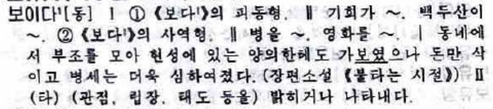
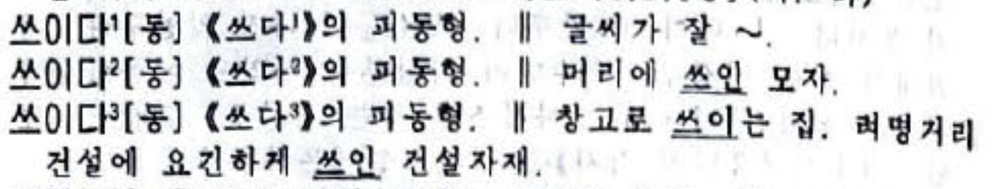
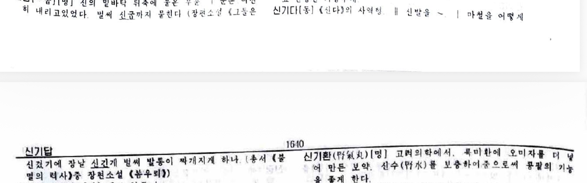
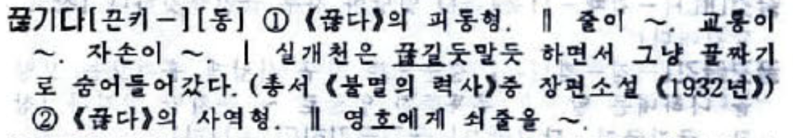
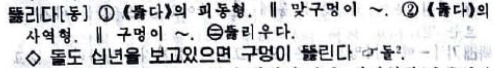
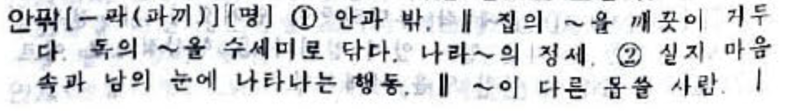
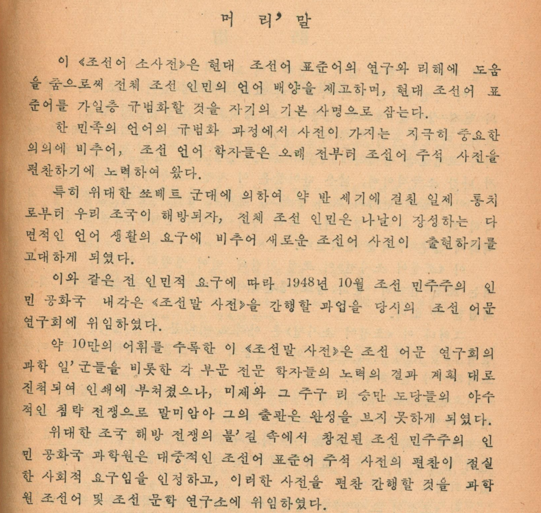

<nav class="page-nav"><a href="02.html">← 第2回</a>　<a href="index.html">目次にもどる</a>　<a href="04.html">第4回 →</a></nav>

# 綴りと発音の不一致（続き）

## 激音化（続き）

### 受身・使役接辞の -히- 

結論を先に言うと、受身・使役接辞の -히- は動詞から動詞を派生させる一種の「活用」のようなものと見なされ、「絶音」にならない。

というより、この接辞は「語幹末の子音を激音化しようとする」接辞であるため、激音化され得ない語幹の後では -이- と綴られる。

| 激音化できない理由 | 例 |
|:--:|:--:|
| 母音終わり | 보다 → 보이다   쓰다  → 쓰이다 |
| 激音終わり | 덮다 → 덮이다 [더피다] |
| 濃音終わり | 섞다 → 섞이다 [서끼다]   깎다 → 깎이다   묶다 → 묶이다 |
| 「ㅎパッチム」 | 놓다  → 놓이다 [노이다]   쌓다  → 쌓이다 [싸이다]  |

また、この接辞は中期朝鮮語において -hí- ~ -kí- ~ -ɣí- と交替したものであり、ㅁ・ㄴ の後では -기- で出る<small>（ただし、これ以外のパッチムの後でも -기- で出ることがある）</small>。<b>この -기- は『濃音化語幹』の濃音化の適用対象外であり</b>、phonotactics 制約に要求されない限りは濃音化しない。<small>（『激音化語幹』の激音化の対象にはなる。）</small>

| パッチム | 例 |
|:--:|:--:|
| ㄴ | 신'다 [신따] → 신기다 [신기다]   안'다 [안따] → 안기다 [안기다]|
| ㅁ | 남'다 [남따] → 남기다 [남기다] |
| ㄻ | 옮'다 [옴따] → 옮기다 [옴기다] |
| ㄶ | 끊다 [끈타] → 끊기다 [끈키다] |

なお、ㄹ の後に来たときは -리- となる。中期朝鮮語で -ɣ- の介在により ㄹ が [ɾ] にならず [l] のままであったのが、現代でも [l] のまま保たれているということになる。

| パッチム | 例 |
|:--:|:--:|
| ㄹ | 열다  → 열리다   날다  → 날리다   알다 → 알리다 |
| ㅀ | 뚫다  → 뚫리다 |

:<: b 南北差

受身・使役接辞の -히- が用言に付きうるか、そしてどのような意味になるかは暗記が必須である。

それに由来する面白い話として、「알리다」の南北差について述べたい。
알다「知る」に受身・使役接辞をつけたこの用言は、韓国では「知らせる、通知する」の意味でしか使わないが、北朝鮮では「感じられる、わかる」の意味もある。

さて、近頃 (2026 年頃)、北朝鮮労働者が IT 系のコミュニティーでしきりに仕事をせがみ経済制裁を逃れようとする活動が活発化している。その朝鮮語からの機械翻訳メッセージで、おそらくこの알리다を（韓国のほうしか知らない翻訳エンジンで）訳したと思われる「知らされます」に遭遇した。

<a href="https://rustfs-s3.yr32.net/public/20260606_mitoujr_kokp_actor/doc.pdf">「活発化する北朝鮮IT労働者について」 https://rustfs-s3.yr32.net/public/20260606_mitoujr_kokp_actor/doc.pdf</a>

このようなことを踏まえると、このセクションを執筆する上で Wiktionary から具体例をただコピペして終わりとするわけにはいかず、北の辞書や文献などに例証されることをいちいち確認する必要がある。

:<: b 確認したものがこちら。

#### 보이다

受身・使役の両義。

#### 쓰이다

「文字を書く」「帽子を被る・傘を差す etc.」「使う」に対して、使役のみ。

#### 신기다

使役のみ。

#### 끊기다

受身・使役の両義。

#### 뚫리다

受身・使役の両義。

:>:

:>:

-히- ではない話だけをしてきたので、そろそろ -히- の話をしよう。

| パッチム | 例 |
|:--:|:--:|
| ㄱ | 먹다 → 먹히다 [머키다]   박다 → 박히다 [바키다]   막다 → 막히다 [마키다] |
| ㅂ | 접다  → 접히다 [저피다]   뽑다 → 뽑히다 [뽀피다]   업다 → 업히다 [어피다]   잡다 → 잡히다 [자피다] |
| ㄼ | 밟다 → 밟히다 [발피다] |
| ㄺ | 읽다 → 읽히다 [일키다]   밝다 → 밝히다 [발키다] |
| ㄵ | 얹다 → 얹히다 [언치다] |
| ㅈ | 맞다 → 맞히다 [마치다] |
| ㄷ | 닫다 → 닫히다 [다<b style="color:red">치</b>다]   묻다「埋める」 → 묻히다 [무<b style="color:red">치</b>다] | 

このように、激音になっている。

ㄷ については後述の「口蓋音化」も同時に起きている。

<!--

웃다  → 웃기다 
맡다  → 맡기다
믿다  → 믿기다 
쫓다 → 쫓기다
찢다 → 찢기다
읽다 → 읽기다 
-->

### 《암-》 「雌」と 《수-》「雄」

これらの接頭辞は中期朝鮮語において 아ᇡ (Yale: amh) および 숳〮 (Yale: swúh) であったため、直後の動物名などの語頭を激音にするが、北の規範では激音化する前の語形で表記するので綴りと発音が不一致となる。

암돼지 [암퇘지], 수강아지 [수캉아지], 수병아리 [수평아리]
암기와 [암키와], 수돌쩌귀 [수톨쩌귀]

:<: box 

南では発音通り表記する。

:>:

一方、안「内」と밖「外」の複合語であり中期朝鮮語 않〮 (Yale: ánh) が直後の ㅂ を ㅍ に激音化させてできた 안팎「内外」は、激音化後の ㅍ の文字で綴る。

## 口蓋音化
ㄷ, ㅌ, ㄾの後ろに合成語以外の이で始まる接辞が来るとき、それぞれが口蓋音となって連音します。
* ㄷ→ㅈ
* ㅌ→ㅊ
* ㄾ→ㄹㅊ

해돋이[해도<b>지</b>] (日の出)
같이[가<b>치</b>] (～のように)
핥이다[<b>할치</b>다] (舐められる)

핥이다 に入っているのはこれまた受身・使役接辞の -히- であるが、これまた「激音化」と見なす必要がないため -이- と綴られている。

:<: b 補足
｢合成語以外の이で始まる接辞｣以外、つまり｢이で始まる単語が結合してできた合成語｣では当然違う挙動を見せる。

<blockquote class=south>
밭이랑[바<b>치</b>랑] 논이랑에 풀 좀 뽑아.
</blockquote>
<blockquote class=south>
밭이랑[<b>반니</b>랑] 논에 물 좀 줘.
</blockquote>
前者は밭(畑)に-이랑(～と)という名詞+接辞であるため、口蓋化する。

後者は밭(畑)+이랑(畝)という名詞+名詞の合成語で、接辞が付いたわけではないので口蓋化はしない。この時、이랑の이が[니]と発音され、それに伴い밭が鼻音化して結果的に[반니랑]と発音される現象が起きるが、これを表す正書法がない。

しかし、過去の正書法を掘り返してくることによってこれを過不足なく表すことが可能なのである。(後述する)
:>:

## 鼻音化

｢鼻音化｣といっても大まかに言って

:<: box

1. 先行子音が後続子音の影響を受け、通常、平音で発せられるべき子音が同調音位置の鼻音で発せられる現象

2. 後続子音ㄹが先行子音の影響を受け、通常、舌側音で発せられるべき子音が同調音位置の鼻音で発せられる現象

3. 先行要素と後続要素で合成語を形成する場合に挿入される子音の影響を受け、通常、平音/舌側音で発せられるべき子音が同調音位置の鼻音で発せられる現象

:>:

の3つがあり、これらを取り違えて覚えてしまわないよう留意する必要がある。

まず、直前が<b>歯茎音以外</b>の鼻音であるときに起こる鼻音化 2（オンセットのㄹからㄴへの変化）について説明する。

<table class="grid w-md">
<tr>
<td></td>
<td>… + ㄹ</td>
</tr>
<tr>
<td>⫽ㅁ⫽ + …</td>
<td>ㅁㄴ</td>
</tr>
<tr>
<td>⫽ㅇ⫽ + …</td>
<td>ㅇㄴ</td>
</tr>
</table>

これは第24項に記載がある現象である。

:<: b 原文

받침소리 [ㅁ, ㅇ]뒤에서 《ㄹ》 은 [ㄴ]으로 발음한다.
례: 목란[몽난], 백로주[뱅노주]

:>:

ところが、困ったことに、第5項では「ㄹは全ての母音の前でㄹと発音することを原則とする」と書かれており、そこには例として「용광로」が挙がっている。

:<: b 原文

《ㄹ》은 모든 모음앞에서 《ㄹ》로 발음하는것을 원칙으로 한다.
례 : 라지오, 려관, 론문, 루각, 리론, 레루, 용광로

:>:

⫽ㅇ⫽ + ㄹ でありながら「ㄹと発音することを原則」の例として「용광로」が掲示されているのは奇妙であり、第24項と矛盾する。第5項でのこれ以外の例は全て語頭のㄹについての例示であるため、hsjoihs は「용광로」の混入はミスであると見なし、⫽ㅇ⫽ + ㄹ は ㅇㄴ と発音するとみなすこととする。
:<: b ねぎ補足
2010年《文化語発音法》(今回の底本)第24項の規定は1966年及び1987年の《文化語発音法》においては存在しておらず、第5項の規定のみが生きていた。(例に挙げられている単語もそのまま。)
しかしながら、現実問題として｢全ての母音の前で律儀に[ㄹ]と発音する｣のは｢無理があり｣、そもそもそういう発音をする人が優位に少なかったために、現実の発音を取り入れる形で規定を追加したのだろう。
故に第5項の例と第24項の規定に矛盾が生じている。
:>:

次に、「鼻音化 1」および「鼻音化 1 に付随する鼻音化 2」について説明する。これは、「口音＋鼻音」および「口音＋流音」が変化を起こす現象であり、鼻音オンセットおよび流音オンセットの前に口音コーダが来ることができないという音素配列論的制約として捉えるべきである。

<table class="grid w-md">
<tr>
<td></td>
<td>… + ㅁ</td>
<td>… + ㄴ</td>
<td>… + ㄹ</td>
</tr>
<tr>
<td>⫽ㅂ⫽ + …</td>
<td>ㅁㅁ (1) 앞마을 [암마을]</td>
<td>ㅁㄴ (1)   앞날 [암날]</td>
<td>ㅁㄴ (1+2)  압력 [암녁]</td>
</tr>
<tr>
<td>⫽ㄷ⫽ + …</td>
<td>ㄴㅁ (1) 젖먹이 [전머기]</td>
<td>ㄴㄴ (1) 믿는다 [민는다]</td>
<td>(おそらく用例無し)</td>
</tr>
<tr>
<td>⫽ㄱ⫽ + …</td>
<td>ㅇㅁ (1) 혁명 [형명] </td>
<td>ㅇㄴ (1) 동녘노을 [동녕노을]</td>
<td>ㅇㄴ (1+2) 목란 [몽난]</td>
</tr>
</table>

ただし、第 24 項によると《ㅑ,ㅕ,ㅛ,ㅠ》の前のㄹは鼻音化しないことが許されるとのことである。

:<: b 原文

제 24 항. 받침소리 [ㅁ, ㅇ]뒤에서 《ㄹ》은 [ㄴ]으로 발음한다.

례: 목란[몽난], 백로주[뱅노주]

그러나 모음 《ㅑ,ㅕ,ㅛ,ㅠ》의 앞에서는 [ㄴ]또는 [ㄹ]로 발음할수도 있다.

례: - 식량[싱냥/싱량], 협력 [혐녁/혐력] - 식료[싱뇨/싱료], 청류벽[청뉴벽/청류벽]

:>:

## 舌側音化

さて、以上の説明では ⫽ㄴ⫽ + ㄹ については触れていない。

また、前回こう述べた。

:<: box

音素配列論としてㄹ+ㄴが登場しないという制約があることに依拠して、「[일<b style="color:magenta">른</b>] という音形も、その制約に依るものである」と主張できる

:>:

ということは、我々は

-  ⫽ㄴ⫽ + ㄹ
- ⫽ㄹ⫽ + ㄴ

について語る義務がある。

なぜこんなにもったいぶっているかというと、<b>ややこしいからである</b>。

前々項の｢鼻音化｣とややこしいが、合成語(と解釈される)か否かがポイントである。
まず、前提として｢⫽ㄴ⫽ + ㄹ｣や｢⫽ㄹ⫽ + ㄴ｣においては、⫽ㄴ⫽(またはㄴ)をㄹで発音する。｣
하늘 날으는듯 [하<b>늘 라</b>르는듣] 空を飛ぶように
권리 [<b>궐리</b>] 権利
삼천리 [삼<b>철리</b>] 三千里(※朝鮮半島全体を指す言葉。)
圧倒的にこちらのパターンのほうが多いため、これを抑えておけば滅多に間違うことはない。
しかしながら、一部単語では<b>何故か</b>これが起こらず、ㄴで発音される現象が起こる。
순리익 [순<b>니</b>익] 純利益
발'전량 [발쩐<b>냥</b>] 発電量
조선로동당 [조선<b>노</b>동당] 朝鮮労働党
これはある一種の｢鼻音化｣と解することもできるが…TODO

# 間の音(사이소리)について

ちょうど日本語に「連濁」という、複合語を形成する際に 2 番目の要素の先頭子音がすり替わり、しかも発生するかどうかを予め知ることができない厄介な現象があるのと同様に、文化語にも「間の音」(사이소리) と呼ばれる<b>現象</b>があります。

ここで「『間の音』という<b>音</b>」とは私は書いて<b>いない</b>ことにご留意ください。

現行正書法である《朝鮮語規範集》が制定されて以降は"特殊な場合を除いて表記しない"(1966年《朝鮮語規範集》第18項)とされていますが、それ以前の《朝鮮語綴字法》(1954年)では間の音を表すために《間の標(사이 표)》(’)を使っていました。
本教材では便宜のため、<b>敢えて《間の標(사이 표)》(’)を使用することにします。</b>
ただし、一部独自の改定を加えています。54年当時の正書法とは用法が一部異なるため、注意してください。

:<: b 実例: 《朝鮮語小辞典》(1956年、朝鮮民主主義人民共和国科学院)

:>:

## この教材における《間の標》の意味

先に結論を言いましょう。《間の標》は、

- 直後が平音であるとき、それを濃音として読むことを意味します。
- 直後が i- / y- であるとき、その直前に《ㄴ》を挿入して読むことを意味します。
- どちらでもないとき、その位置に《ㄷ》を置くことを意味します。

なぜこのような<b>珍妙な</b>記号を導入したくなるかについて、以下話していきます。

## 観察①：予期せぬ濃音化

合成語またはこれに準じうる単語の間で、1番目の語根の音節末が母音や[ㄴ, ㄹ, ㅁ, ㅇ]である場合に、2番目の語根の初声が平音であるのに、濃音化が生じることがあります。
綴りから発音をなるべく読み取れる正書法をデザインしたい場合、これを明記するための記号が欲しくなりますよね。

- [기] + [발] なのに [기빨] (旗) 。これを明記するために 기'발 と表記する。
- [일] + [군] なのに [일꾼] (活動家、従事者、幹部、イルクン)。これを明記するために 일'군 と表記する。
- [나루] + [배] なのに [나루빼] (渡し船)。これを明記するために 나루'배 と表記する。
- [그믐] + [달] なのに [그믐딸] (みそかの月)。これを明記するために 그믐'달 と表記する。

:<: b 補足

《文化語発音法》で

> 単語や単語結合で間の音が平音の前に挟まって出る場合、その平音を濃音で発音する。
(第16項)

> 固有語で作られている一部合成語や単語結合で間の音が挟まって出る場合は形態部に《ㄷ》を挟んで発音する。
(第27項)

としており、一般的には｢《ㄷ》が挟まったことによる濃音化｣と見るべきだ。しかし、第16項の例で나루가の発音表示が[나루까]と表記されているのに対し、第27項では바다가[바닫가→바다까]と表記されているところを見るに、南における間の音の発音規定(『標準発音法』第30項)と同様、間の音を[ㄷ]で発音することはあくまでも許容発音に過ぎないと見ても良いかもしれない。

hsjoihs の疑念：そもそも朝鮮語において 「母音 + ㄷ + ㄲ + 母音」と「母音 + ㄲ + 母音」は本当に対立しているのであろうか？　実際には対立していないからこそ規格策定者に迷いが発生する余地があるのではなかろうか？
疑念に対するねぎの返信: 微妙なところ。
『文化語発音辞典』では｢ㄷが入っているもの｣と｢そうでないもの｣がちょくちょく混じっている気がする。
例えば、｢새별[새ː뻘]は｢샛별のこと｣とされており、샛별[샏ː뼐]は｢夜明けに明るく輝く星のこと(ねぎ注: 日本語なら｢明星｣が適切か？)｣とされていたりする。

『文化語発音常識』では
｢우리 말 맞춤법에서는 두 단어(ねぎ注: 새별と샛별のこと)의 이러한 발음상차이를 고려하여 표기에서 사이소리가 끼워나는 《샛별》은 두형태부사이에 《ㅅ》받침을 끼워넣도록 규정하고있다. 그러나 표기실천에서는 형태부사이에 《ㅅ》을 끼워넣지 않고 형태를 밝혀적는 경향이 적지 않게 나타나고있다. 단어의 표기가 어떻게 이루어지든 단어발음에서 《신성》의 뜻을 가진 단어는 [새별]로, 《금성》의 뜻을 가진 단어는 [새뼐]로 구별하여 발음해야 한다.｣(P96)
となっている。

また、同書では間の音を生ずることに関して｢쉽게 말하면 된소리로 바뀌여나거나 사이에 받침소리 [ㄴ]가 덧끼워나는 발음현상을 말한다. 실례로 《고기》와 《국》이 합처저 《고기국》이라는 단어를 이를 때 뒤요소의 첫소리가 된소리로 되여 [고기꾹]으로 되는것을 들수 있다.｣(P92)ともしており、おそらく[ㄷ]を挟んで発音すること自体のことを指しているわけではないようである。(明確に対立があるか否かは不明ではあるが。)

:<: b 補足の補足

南での『標準発音法』第30項では、このような記載がされている。

<blockquote class="south">
사이시옷이 붙은 단어는 다음과 같이 발음한다.
'ㄱ, ㄷ, ㅂ, ㅅ, ㅈ'으로 시작하는 단어 앞에 사이시옷이 올 때는 이들 자음만을 된소리로 발음하는 것을 원칙으로 하되, 사이시옷을 [ㄷ]으로 발음하는 것도 허용한다
</blockquote>

つまり、南ではこのようになっている。

<blockquote class="twitter-tweet">
나뭇가지みたいに사이시옷が書かれた複合語の発音、  [나무까지]が原則で、  [나묻까지]みたいにㄷを入れるのは許容発音なんだけど、  これってどれくらいの人が知ってるんだろう
&mdash; わっしー 왓시 wasshie (@xhioe) <a href="https://x.com/xhioe/status/2098738962181595226?ref_src=twsrc%5Etfw">September 12, 2026</a></blockquote> 

:>:

この論理だと、｢(少なくとも歴史的過程を全く考慮に入れなければ)わざわざㅅパッチムで書く必要性があまりない｣と取ることもでき、北は｢じゃあ別に記号化してもいいじゃんね？｣ということで《間の標》の導入<small>(ひいては廃止)</small>へと舵を切ったのではなかろうか？とねぎは推測している。

:>:

同様に、一部漢字語で、予期せぬ濃音化を伴うものはその直前に《間の標》を置きます。
군'적(郡的), 도'적(道的), 대'가(代價), 리'과(理科), 수'자(數字), 호'수(號數)

:<: b 補足

《間の標》を用いていた時代の朝鮮語においても、しばしば《間の標》は省略された。やはり母語話者にとっては必要性の低い符号であったのだろう。我々は学習者なので、明確に利便性が上がるこの記法を採用する。

:>:

## 観察②：鼻音始まりの要素の前の予期せぬ《ㄴ》

合成語またはこれに準じうる単語の間で、1番目の語根の音節末が母音であり、2番目の語根の初声が鼻音である場合に、間に《ㄴ》の音が生じることがあります。
一部接頭辞と語根との組み合わせについても同様です。

- [내] + [물] なのに [낸물] (小川) 。これを明記するために 내'물 と表記する。 
- [새] + 노랗다 なのに [샌노라타] (真っ黄色)  。これを明記するために 새'노랗다 と表記する。 
- [시] + [누렇다] なのに [신누러타] (真っ黄色)  。これを明記するために 시'누렇다 と表記する。

## 観察③：i- / j- 始まりの要素の前での予期せぬ《ㄴ》

- 덧 + 이 なのに [던니] (八重歯、鬼歯) 。이 の前に予期せぬ《ㄴ》が入っていると見れば、덧 を [던] と読むことについては「鼻音化」として正当化できる。
この予期せぬ《ㄴ》を明記するために 덧'이 と表記する。

:<: b 補足

《ㄴ挿入》は i- / j- 始まりの語にしか起きず、《間の音》によって表記されるべき濃音化は i- / j- 始まりの語には起きえないため、「直後を《ㄴ挿入》させる記号」と「直後を濃音化させる記号」を同一のものとしても支障がない。

:>:

:<: b 補足 2
現在の規範ではこれを<b>表記しない</b>こともあいまってか、そもそも《間の音》を生じずに発音することも少なくない。
:>:

## 観察④：i- / j- 始まりの要素の前での予期せぬ《ㄴㄴ》

i- / j- 始まりの要素の前での予期せぬ《ㄴㄴ》が生じる場合があります。

これのことを、

- ③により、「i- / j- 始まりの要素の前での予期せぬ《ㄴ》」ができ、
- さらにその前に「②：鼻音始まりの要素の前の予期せぬ《ㄴ》」ができる

と解釈し、この教材では《間の標》を<b>二重に置くこととします。</b>

- 깨 + 잎 で [깬닙]（エゴマの葉）。予期せぬ《ㄴㄴ》が生じているので 깨''잎 と表記することとする。
- 뒤 + 이야기 で [뒨니야기]（後語り）。予期せぬ《ㄴㄴ》が生じているので 뒤''이야기 と表記することとする。
- 아래 + 이 で [아랜니]（下の歯）。予期せぬ《ㄴㄴ》が生じているので 아래''이 と表記することとする。

伝統的には、これを「《間の音》を生じ、その後《ㄴ挿入》を伴う」と解釈します。後述する理由により《間の音》を一旦 ㅅ と書いてみることにすると

깨''잎 (깨ㅅ잎→깨ㅅ<b>닢</b>) エゴマの葉
뒤''이야기 (뒤ㅅ이야기→뒤ㅅ<b>니</b>야기) 後語り
아래''이 (아래ㅅ이→아래ㅅ<b>니</b>) 下の歯 (※参考: 南は 아랫니 と綴る。)

というわけです。

:<: b 補足

《間の標》を二重に置く表記は、ねぎおよび hsjoihs の知る限り朝鮮語で実運用されたことはない。しかし、採用した方が正書法が規則的となり、説明をしやすいため、ここではこのような表記を用いることとする。

:>:

## 観察⑤：未来連体形のㄹの直後の義務的な濃音化

未来連体形を表すㄹの直後に平音が来る場合も、この教材では《間の標》を置きます。
굴할'줄 屈する-術(=こと)
이르갈' 분 成し遂げる方

:<: b i- / j- の前ではどうか

少なくとも南では 할 일 を [할릴] と発音する現象が見られますが、これが未来連体形起因なのか 일 ならではなのかは自信がありません（무슨 일 も [무슨닐] なので。

:>:

<nav class="page-nav"><a href="02.html">← 第2回</a>　<a href="index.html">目次にもどる</a>　<a href="04.html">第4回 →</a></nav>