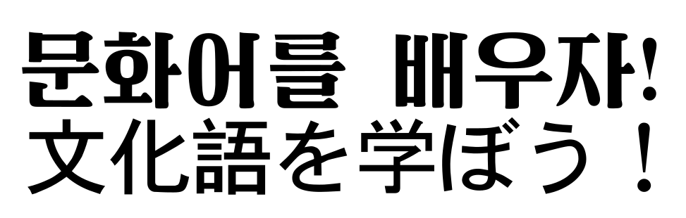
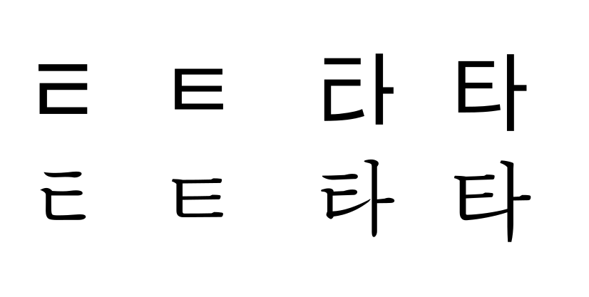
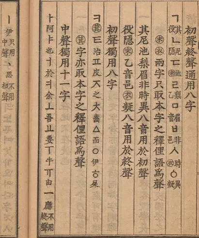
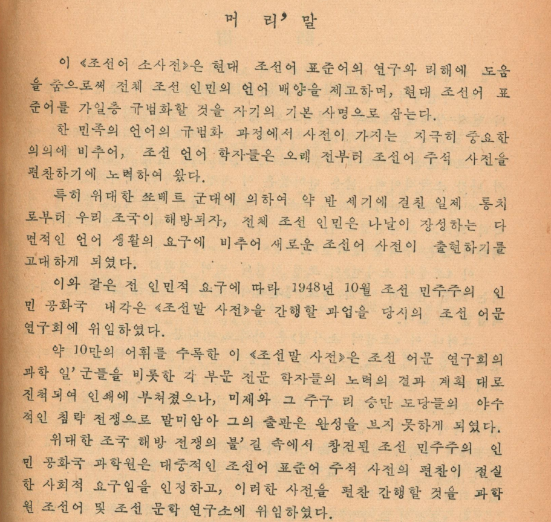
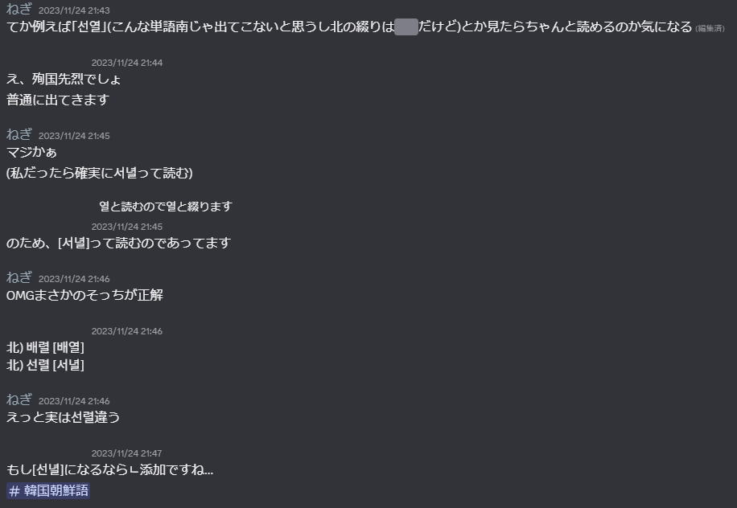
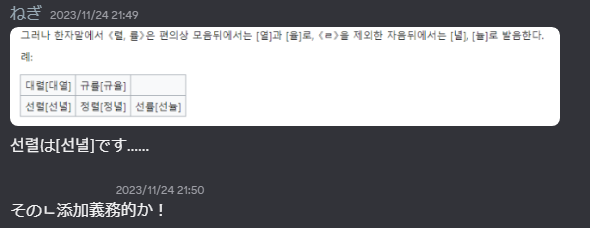

<nav class="page-nav"><a href="to.html">補足教材：토について →</a></nav>

# 参考文献

- https://upload.wikimedia.org/wikipedia/commons/0/0b/조선말규범집(2010).pdf
- https://upload.wikimedia.org/wikipedia/commons/9/94/조선말규범집(1988).pdf
- https://upload.wikimedia.org/wikipedia/commons/9/9d/조선말규범집(1966).pdf

# 発音と音節

## 子音

### 分類
* 平音(=阻害音)
* 激音(=有気音)
* 濃音(=fortis)
<table border="1" cellspacing="0" cellpadding="3" bordercolordark="white" bordercolorlight="black">
  <tbody><tr><td colspan="2">&nbsp;</td><th>両唇音</th><th>歯茎音</th>
      <th>歯茎摩擦音</th><th>硬口蓋破擦音</th>
      <th>軟口蓋音</th><th>喉頭音</th></tr>
  <tr><th rowspan="3">口音</th><th>平音</th>
      <td align="center">ㅂ</td><td align="center">ㄷ</td>
      <td align="center">ㅅ</td><td align="center">ㅈ</td>
      <td align="center">ㄱ</td><td align="center">&nbsp;</td></tr>
  <tr><th>激音</th>
      <td align="center">ㅍ</td><td align="center">ㅌ</td>
      <td align="center">&nbsp;</td><td align="center">ㅊ</td>
      <td align="center">ㅋ</td><td align="center">ㅎ</td></tr>
  <tr><th>濃音</th>
      <td align="center">ㅃ</td><td align="center">ㄸ</td>
      <td align="center">ㅆ</td><td align="center">ㅉ</td>
      <td align="center">ㄲ</td><td align="center">&nbsp;</td></tr>
  <tr><th colspan="2">鼻音</th>
      <td align="center">ㅁ</td><td align="center">ㄴ</td>
      <td align="center">&nbsp;</td><td align="center">&nbsp;</td>
      <td align="center">ㅇ</td><td align="center">&nbsp;</td></tr>
  <tr><th colspan="2">流音</th>
      <td align="center">&nbsp;</td><td align="center">ㄹ</td>
      <td align="center">&nbsp;</td><td align="center">&nbsp;</td>
      <td align="center">&nbsp;</td><td align="center">&nbsp;</td></tr>
</tbody></table>
鼻音等も平音に分類する流派もありますが、説明において特に有意義とは思えないので採用しません。

軟口蓋鼻音 /ŋ/ は語頭・発話頭に立つことがなく、さらには閉音節の直後に来ることもありません。その由来や音声的実現にかかわらず、/ŋ/ は常にコーダしか占めないとして分析し、そのように表記されます。なお、コーダ位置で軟口蓋鼻音を表すために用いられる文字ㅇは、オンセット位置で用いられるとゼロ子音を表します。

:<: b 歴史言語学的に興味深い例

漢語「鮒魚」（鄭張尚芳の再構音での中古漢語：/bɨoH ŋɨʌ/）に由来する붕어「フナ」という語は、本来オンセット位置にあった軟口蓋鼻音 /ŋ/ を直前の音節のコーダと見る形で書かれる。

:>:

## 単母音（でしか発音されない母音字）

実態としては、七母音体系を基本とすると見るべきでしょう。

<table border="1" cellspacing="0" cellpadding="3" bordercolordark="white" bordercolorlight="black">
  <tbody>
  <tr><td>&nbsp;</td><th>前舌</th><th>中舌</th>
      <th colspan="2">後舌</th></tr>
   <tr><td>&nbsp;</td><th colspan="3">非円唇</th>
      <th>円唇</th></tr>
      <tr><td align="center">狭</td><td align="center">ㅣ</td><td></td><td align="center">ㅡ</td><td align="center">ㅜ</td></tr>
      <tr><td align="center">中段</td><td align="center">ㅔ, ㅐ</td><td align="center">ㅓ</td><td></td><td align="center">ㅗ</td></tr>
      <tr><td align="center">広</td><td></td><td align="center">ㅏ</td><td></td><td></td></tr>
</tbody></table>      

### ㅔとㅐの発音について

規範としてはこれらはそれぞれ半狭・半広で発音されるということになってはいますが、朝鮮中央テレビのアナウンサーも正書法上のこれらの区別と音声での反映との間に一貫性がないという研究もあるため、対立が残存しているとは言い難いとhsjoihsは判断します。

<blockquote>

Notably, older anchor Ri Chun-hee and even Kim Jong-un both have /e/ and /ɛ/ merged.

https://en.wikipedia.org/wiki/Korean_phonology#Vowels

</blockquote>

### ㅓの発音について
ほぼ /ə/
南のㅓよりは｢狭く、前舌め｣
(※2000年代以前のソウル方言のㅓと近いかもしれない)

## 半母音+母音（として発音されうる母音字）

### /j/ を伴うもの

先ほど見せた七母音を表す八種の母音字のうち、短い棒を持つㅏㅓㅗㅜㅐㅔは、短い棒の本数を倍増させることにより、「/j/ + 母音」を表します。

ㅏ→ㅑ /ja/, ㅓ→ㅕ /jŏ/, ㅗ→ㅛ /jo/, ㅜ→ㅠ /ju/, ㅐ→ㅒ /jae/, ㅔ→ㅖ /je/

### ㅖ
계, 례, 혜はそれぞれ[게], [레], [헤]、それ以外は基本的に[ㅖ]で発音されます。

### 円唇性を伴うもの

後舌かつ円唇の単母音を表すㅗやㅜの字と、前舌または中舌の単母音を表すㅣㅔㅐㅓㅏの字を組み合わせることにより、以下の複合字母が構築されます。

| | ㅜ | ㅗ |
|:--:|:--:|:--:|
| ㅣ | ㅟ |ㅚ |
| ㅔ | ㅞ |  |
| ㅐ | | ㅙ |
| ㅓ | ㅝ | | 
| ㅏ | |  ㅘ |

これらは発音に円唇性を伴います。

ㅞㅙㅝㅘは（規範も実態も）対応する前舌または中舌母音の前に /w/ を発音するという字母です。
ㅟ は単母音 /y/ で発音される例もたまに耳にしますが、多くの場合実態は /wi ~ ɥi/ です。
ㅚ は単母音 /ø/ で発音される場合もㅞやㅙのように発音されることも共に珍しくないという印象です。

:<: b 補足：회

漢字語に頻出する회は、/hæ~he/ のように発音されることも珍しくない。사회주의を사헤주의っぽく言ってる例が散見される。

また、

https://youtu.be/xO7FqapK8Gc?si=3swOVqx6KpUA_HQh&t=920

> 이번 발표<b>회</b>에는

https://youtu.be/xO7FqapK8Gc?si=X50YaOb_efP0vAwv&t=907

> 이번 과학기술발표<b>회</b>에는

などの例において、/(ɦ)ø/ が前後の母音を巻き込む形で、/pʰjoøe/ > [pʰjøːː] のように発音する現象が見られる。

:>:

### ㅢ

規範では「二重母音で発音することを原則とする」と書きつつも、附則 (불임) にて

- 子音が結合したときや、単語の途中および末尾にある ㅢ は [ㅣ] で発音することを許容する
   - 例: 희망[희망/히망] 띄우다[띠우다], 씌우다[씨우다]
   - 결의문[겨릐문/겨리문], 정의 [정이], 의의 [의이], 회의[회의/회이]
- 属格の토として使われる場合一部 [ㅔ]と同様に発音することを許容する
   - 例: 혁명의 북소리 [형명에 북쏘리]
   - 우리의 집은 당의 품[우리에 지븐 당에 품] 

と記載されている。<small>（ㅢ と ㅣ の両方を併記する場合と、ㅣ しか提示していない場合があるが、その差は少なくともhsjoihsには謎。）</small>

実用上は、

- 語頭に来ているときには [ɰi]
- 属格助詞は [e]
- それ以外なら [i]

とすればよかろう。

:<: b ねぎ補足
時折律儀に[ㅢ]で発音する人もいるが、圧倒的少数なので見かけた際はレアケースだなぁくらいに思っておくと良い。
:>:

## 文化語の音節

文化語の音節は (C)(G)V(C)、つまり

- 前述の表から /ŋ/ を除いた頭子音（ゼロでありうる）
- 母音もしくは「半母音 + 母音」
- 以下に述べる 7 種類のコーダ、もしくはゼロ

によって構成される。

### 7 種類のコーダ

コーダ位置では、摩擦音・破擦音が表れない。
また、口音に存在した平音・激音・濃音の対立が潰れる。この教材では、慣習に合わせて平音の字母を用いて表記するが、archiphoneme であることを明記すべく ⫽ㅂ⫽ などと表記することとする。

<table border="1" cellspacing="0" cellpadding="3" bordercolordark="white" bordercolorlight="black">
  <tbody><tr><td>&nbsp;</td><th>両唇音</th><th>歯茎音</th>
      <th>軟口蓋音</th></tr>
  <tr><th>口音</th>
      <td align="center">⫽ㅂ⫽</td><td align="center">⫽ㄷ⫽</td>
      <td align="center">⫽ㄱ⫽</td>
  <tr><th>鼻音</th>
      <td align="center">⫽ㅁ⫽</td><td align="center">⫽ㄴ⫽</td>
      <td align="center">⫽ㅇ⫽</td>
  <tr><th>流音</th>
      <td align="center">&nbsp;</td><td align="center">⫽ㄹ⫽</td>
      <td align="center">&nbsp;</td>
</tbody></table>

# 文字の詳細

## ㅌのデザイン差について

## 文字順

文字順は韓国と異なります
ㄱㄴㄷㄹㅁㅂㅅㅇㅈ ㅊㅋㅌㅍㅎ ㄲㄸㅃㅆㅉ
ㅏㅑㅓㅕㅗㅛㅜㅠㅡㅣㅐㅒㅔㅖㅚㅟㅢㅘㅝㅙㅞ

## 文字名

文字名は [子音]ㅣ으[子音]
ㄱ: 기윽 (南: 기<u><b>역</b></u>)
ㄴ: 니은
ㄷ: 디읃 (南: 디<u><b>귿</b></u>)
ㄹ: 리을
ㅁ: 미음
ㅂ: 비읍
ㅅ: 시읏 (南: 시<u><b>옷</b></u>)
ㅇ: 이응
ㅈ: 지읒

ㅊ: 치읓
ㅋ: 키읔
ㅌ: 티읕
ㅍ: 피읖
ㅎ: 히읗

濃音は된-(濃い-)を前につけます。(南: 쌍-(雙-))
ㄲ: 된기윽
ㄸ: 된디읃
ㅃ: 된비읍
ㅆ: 된시읏
ㅉ: 된지읒

:<: b 経緯

:>:

また、各々 [子音] + 으 と呼ぶこともできる。
그, 느, 드, 르, 므, 브, 스, 으, 즈, 츠, 크, 트, 프, 흐, 끄, 뜨, 쁘, 쓰, 쯔

# 文化語における曲用と活用

次の章で「綴りと発音の不一致」について説明するが、
その前に「<b>どのような言語現象を表そうとして</b>そのような仕組みが作られているのか」について知っておく必要がある。

というのも、朝鮮語における綴りと発音の不一致の中には

- 音素配列論的制約による自動的なもの
- ある程度「語幹の文字」と「語尾の文字」を分けて表記しつつ、中程度に複雑な体言の曲用と動詞の活用を表現できるようにするための工夫
- 暗記する必要がある語彙的現象

の 3 種類が混ぜこぜになっているからである。

よって、ここではまず表音的に文化語における曲用と活用について解説する。

## 用言

hsjoihs は、朝鮮語の用言を【母音・リウル語幹】【激音化語幹】【濃音化語幹】の 3 種類に分類すべきであると考える。

### 母音・リウル語幹

語幹が母音またはㄹで終わる語幹であり、直後の接辞と結合する際に [ㅡ] を用いることがなく、直後の接辞が平音であることが許される。

### 激音化語幹

[ㅡ] を用いずに語幹が直後の接辞と結合する際、直後の接辞に平音を許さず、代わりに<b><u>激音</u></b>が登場する。

### 濃音化語幹

[ㅡ] を用いずに語幹が直後の接辞と結合する際、直後の接辞に平音を許さず、代わりに<b><u>濃音</u></b>が登場する。

## 用言の活用例

TODO

## 体言

# 綴りと発音の不一致

## パッチムについて
朝鮮語で用いるパッチムとその発音は次の通り。

ㄱ, ㄳ, ㅋ, ㄲ: ⫽ㄱ⫽

ただし、動詞･形容詞の語幹末に来た《ㄺ》は《ㄱ》の前で⫽ㄹ⫽

ㄴ, ㄵ, ㄶ: ⫽ㄴ⫽

ㄷ, ㅌ, ㅅ, ㅆ, ㅈ, ㅊ: ⫽ㄷ⫽

ㅂ, ㅍ, ㄼ, ㄿ, ㅄ: ⫽ㅂ⫽

ただし、形容詞語幹末に来た《ㄼ》は《ㄱ》の前で ⫽ㄹ⫽
そして、《여덟》(固有数詞 8)のとき ⫽ㄹ⫽

ㄽ, ㄾ, ㅀ: ⫽ㄹ⫽

ㅁ, ㄻ: ⫽ㅁ⫽

ㅇ: ⫽ㅇ⫽

ㅎ: 単語の最後の音節と《ㅅ》や《ㄴ》で始まる토(後述)の前で ⫽ㄷ⫽ のように発音する。

:<: b 補足

規定では"無声子音の前と発音が終わるときには…"というようにしているが、省いてしまってもさほど問題がないので今回は簡略化した。
また、ㄼの発音の処理方法が南と異なる。
南では基本を[ㄹ]とし、"밟- は子音の前で[ㅂ]、넓- は派生語･合成語で[ㅂ]と読む"としているため、넓다の発音が異なる。
넓다 北: [넙따] 南: [널따]

:>:

## 連音

母音で始まる토(後述)や接尾辞の前にあるパッチムは連音する。
2つのパッチムの場合には左側のパッチムをパッチムとして発音し、右側を次の母音へ連音させる。

ただし、呼びかけを意味する토(後述)《-아》の前ではパッチムは絶音(次項参照)させて発音する。

また、漢字語では母音の前に置かれたパッチムはすべて連音させる。

## 絶音

絶音とは、パッチムの字母を発音が終わるときのパッチムの発音に変え、後ろの母音に連音させて発音することである。

母音《아, 어, 오, 우, 애, 외》で始まる固有語語根の前で絶音させる。

《있다》の前のパッチムは絶音させる。

ただし、《맛있다》,《멋있다》は連音させて発音することを許容する。

単語が結合関係になっている場合にも、前の単語がパッチムで終わって後ろの単語が母音で始まるときは絶音させる。

## 濃音化

ひとえに「濃音化」とはいっても、多様な要因に起因する。これらを分けて取り扱うことが極めて重要である。

:<: box

「閉鎖音パッチムの直後であって、そもそも<u><b>平音と濃音の対立が存在しない</b></u>」ことを指して呼ぶ「濃音化」

「論理的には ㅆ で綴るべきものを、慣習として ㅅ で綴ることにしてしまったせいで、つじつま合わせで『濃音化』とされるもの
例： -습니다 の頭の子音が ㅅ で発音されることは<u><b>決してない</b></u>。

「未来連体形」

【母音・リウル語幹】以外の動詞は直後の接尾辞に平音を許さず、必ず激音か濃音で出現させるという現象がある（この現象をこの形で記述してくれている本が全く見られないことを hsjoihs は腹立たしいと思っている）。この現象に対して、伝統的な教育では様々な場所にこの激音・濃音の説明を散らばらせているが、hsjoihs はむしろ動詞を【母音・リウル語幹】【激音化語幹】【濃音化語幹】の 3 種類に分類したほうが遥かに筋がよいと思っている。

:>:

:<: b 補足

"伝統的な教育では……散らばらせている"というのは、"正書法･発音法等の記述で1項にまとまっていない"ということである。
《文化語発音法》
【第13項】動詞や形容詞の語幹末のパッチム《ㄴ, ㄵ, ㄻ, ㅁ》と《ㄹ》で発音されるパッチム《ㄺ, ㄼ, ㄾ》の後ろに来る토や接尾辞の阻害音は濃音で発音する。
【第14項】 次のような場合に《ㄹ》パッチムの後ろの阻害音は濃音で発音する。
1\) 漢字語で後ろの阻害音が《ㄷ, ㅅ, ㅈ》であるとき
2\) 一部固有語でできた補助的単語が《ㄹ》の後ろに来るとき
3\) 規定토《ㄹ》の後ろに来るとき
【第17項】語幹末のパッチム《ㅎ, ㄶ, ㅀ》の後ろに来る토の阻害音《ㅅ》は濃音で発音する。

というように、個別に対応する形を取っている。
今回、動詞を【母音･リウル語幹】【激音化語幹】【濃音化語幹】の3つに分類する方向をとった。

:>:

｢『閉鎖音パッチムの直後であって、<u><b>そもそも平音と濃音の対立が存在しない</b></u>』という意味での『濃音化』｣というのは、いわゆる｢音素配列論(phonotactics)｣である。

<table class="grid w-sm">
<tr>
<td></td>
<td>ㅂ</td>
<td>ㄷ</td>
<td>ㅈ</td>
<td>ㅅ</td>
<td>ㄱ</td>
</tr>
<tr>
<td>⫽ㅂ⫽ + …</td>
<td>[ㅃ]</td>
<td class="blocked"></td>
<td class="blocked"></td>
<td class="blocked"></td>
<td class="blocked"></td>
</tr>
<tr>
<td>⫽ㄷ⫽ + …</td>
<td class="blocked"></td>
<td>[ㄸ]</td>
<td class="blocked"></td>
<td class="blocked"></td>
<td class="blocked"></td>
</tr>
<tr>
<td>⫽ㄱ⫽ + …</td>
<td class="blocked"></td>
<td class="blocked"></td>
<td class="blocked"></td>
<td class="blocked"></td>
<td>[ㄲ]</td>
</tr>
</table>

灰部が朝鮮語において実現し得ない。代わりに後続する子音が濃音として実現されるのである。

<table class="grid w-sm">
<tr>
<td></td>
<td>ㅂ</td>
<td>ㄷ</td>
<td>ㅈ</td>
<td>ㅅ</td>
<td>ㄱ</td>
</tr>
<tr>
<td>⫽ㅂ⫽ + …</td>
<td>[ㅃ]</td>
<td><u>[ㄸ]</u></td>
<td><u>[ㅉ]</u></td>
<td><u>[ㅆ]</u></td>
<td><u>[ㄲ]</u></td>
</tr>
<tr>
<td>⫽ㄷ⫽ + …</td>
<td><u>[ㅃ]</u></td>
<td>[ㄸ]</td>
<td><u>[ㅉ]</u></td>
<td><u>[ㅆ]</u></td>
<td><u>[ㄲ]</u></td>
</tr>
<tr>
<td>⫽ㄱ⫽ + …</td>
<td><u>[ㅃ]</u></td>
<td><u>[ㄸ]</u></td>
<td><u>[ㅉ]</u></td>
<td><u>[ㅆ]</u></td>
<td>[ㄲ]</td>
</tr>
</table>

## 鼻音化

｢鼻音化｣といっても大まかに言って

:<: box

1. 先行子音が後続子音の影響を受け、通常、平音で発せられるべき子音が同調音位置の鼻音で発せられる現象

2. 後続子音ㄹが先行子音の影響を受け、通常、舌側音で発せられるべき子音が同調音位置の鼻音で発せられる現象

3. 先行要素と後続要素で合成語を形成する場合に挿入される子音の影響を受け、通常、平音/舌側音で発せられるべき子音が同調音位置の鼻音で発せられる現象

:>:

の3つがあり、これらを取り違えて覚えてしまわないよう留意する必要がある。

まず、直前が<b>歯茎音以外</b>の鼻音であるときに起こる鼻音化 2（オンセットのㄹからㄴへの変化）について説明する。

<table class="grid w-md">
<tr>
<td></td>
<td>… + ㄹ</td>
</tr>
<tr>
<td>⫽ㅁ⫽ + …</td>
<td>ㅁㄴ</td>
</tr>
<tr>
<td>⫽ㅇ⫽ + …</td>
<td>ㅇㄴ</td>
</tr>
</table>

これは第24項に記載がある現象である。

:<: b 原文

받침소리 [ㅁ, ㅇ]뒤에서 《ㄹ》 은 [ㄴ]으로 발음한다.
례: 목란[몽난], 백로주[뱅노주]

:>:

ところが、困ったことに、第5項では「ㄹは全ての母音の前でㄹと発音することを原則とする」と書かれており、そこには例として「용광로」が挙がっている。

:<: b 原文

《ㄹ》은 모든 모음앞에서 《ㄹ》로 발음하는것을 원칙으로 한다.
례 : 라지오, 려관, 론문, 루각, 리론, 레루, 용광로

:>:

⫽ㅇ⫽ + ㄹ でありながら「ㄹと発音することを原則」の例として「용광로」が掲示されているのは奇妙であり、第24項と矛盾する。第5項でのこれ以外の例は全て語頭のㄹについての例示であるため、hsjoihs は「용광로」の混入はミスであると見なし、⫽ㅇ⫽ + ㄹ は ㅇㄴ と発音するとみなすこととする。

次に、「鼻音化 1」および「鼻音化 1 に付随する鼻音化 2」について説明する。これは、「口音＋鼻音」および「口音＋流音」が変化を起こす現象であり、鼻音オンセットおよび流音オンセットの前に口音コーダが来ることができないという音素配列論的制約として捉えるべきである。

<table class="grid w-md">
<tr>
<td></td>
<td>… + ㅁ</td>
<td>… + ㄴ</td>
<td>… + ㄹ</td>
</tr>
<tr>
<td>⫽ㅂ⫽ + …</td>
<td>ㅁㅁ (1)</td>
<td>ㅁㄴ (1)</td>
<td>ㅁㄴ (1+2)</td>
</tr>
<tr>
<td>⫽ㄷ⫽ + …</td>
<td>ㄴㅁ (1)</td>
<td>ㄴㄴ (1)</td>
<td>(おそらく用例無し)</td>
</tr>
<tr>
<td>⫽ㄱ⫽ + …</td>
<td>ㅇㅁ (1)</td>
<td>ㅇㄴ (1)</td>
<td>ㅇㄴ (1+2)</td>
</tr>
</table>

## 激音化
1. ㅎパッチムと後続子音との組み合わせで起こる｢激音化｣

[パッチムについて]の項で述べたように、ㅎパッチムは｢単語の最後の音節と《ㅅ》や《ㄴ》で始まる토(後述)の前で[ㄷ]のように発音する。｣という規定になっており、ㄷパッチムのように振る舞っているかのように見えるが、そもそもこの字は<b>パッチムの位置における固有の音価を持っておらず</b>、<b>後続する子音を激音にするというマーカー</b>としてしか用いられていない。

좋다 [조타]
좋아 [조아]

2. 口音パッチムに後続するㅎとの組み合わせで起こる｢激音化｣

:<: b 補足

【第18項】토や接尾辞の最初に来た阻害音は語幹末のパッチム《ㅎ, ㄶ, ㅀ》の後ろで激音で発音する。

:<: b 補足の補足
そもそも諸々の規定は解放前に定められた『朝鮮語綴字法統一案』をもとにしたものだが、この『統一案』の制定時の議論でもㅎパッチムを認めるか否か

:>:
:>:

## 舌側音化

前々項の｢鼻音化｣とややこしいが、合成語(と解釈される)か否かがポイントである。

## 口蓋音化

## 間の音(사이소리)について
現行正書法である《朝鮮語規範集》が制定されて以降は"特殊な場合を除いて表記しない"(1966年《朝鮮語規範集》第18項)とされていますが、それ以前の《朝鮮語綴字法》(1954年)では間の音を表すために《間の標(사이 표)》(’)を使っていました。
本教材では便宜のため、<u><b>敢えて《間の標(사이 표)》(’)を使用することにします。</b></u>
ただし、一部独自の改定を加えています。54年当時の正書法とは用法が一部異なるため、注意してください。

:<: b 実例: 《朝鮮語小辞典》(1956年、朝鮮民主主義人民共和国科学院)

:>:

:<: b 補足

《文化語発音法》で

> 単語や単語結合で間の音が平音の前に挟まって出る場合、その平音を濃音で発音する。
(第16項)

> 固有語で作られている一部合成語や単語結合で間の音が挟まって出る場合は形態部に《ㄷ》を挟んで発音する。
(第27項)

としており、一般的には｢《ㄷ》が挟まったことによる濃音化｣と見るべきだ。しかし、第16項の例で나루가の発音表示が[나루까]と表記されているのに対し、第27項では바다가[바닫가→바다까]と表記されているところを見るに、南における間の音の発音規定(『標準発音法』第30項)と同様、間の音を[ㄷ]で発音することはあくまでも許容発音に過ぎないと見ても良いかもしれない。

:<: b 補足の補足

南での『標準発音法』第30項では、このような記載がされている。

<blockquote class="south">
사이시옷이 붙은 단어는 다음과 같이 발음한다.
'ㄱ, ㄷ, ㅂ, ㅅ, ㅈ'으로 시작하는 단어 앞에 사이시옷이 올 때는 이들 자음만을 된소리로 발음하는 것을 원칙으로 하되, 사이시옷을 [ㄷ]으로 발음하는 것도 허용한다
</blockquote>

つまり、南ではこのようになっている。

<blockquote class="twitter-tweet">
나뭇가지みたいに사이시옷が書かれた複合語の発音、  [나무까지]が原則で、  [나묻까지]みたいにㄷを入れるのは許容発音なんだけど、  これってどれくらいの人が知ってるんだろう
&mdash; わっしー 왓시 wasshie (@xhioe) <a href="https://x.com/xhioe/status/2098738962181595226?ref_src=twsrc%5Etfw">September 12, 2026</a></blockquote> 

:>:

この論理だと、｢(少なくとも歴史的過程を全く考慮に入れなければ)わざわざㅅパッチムで書く必要性があまりない｣と取ることもでき、北は｢じゃあ別に記号化してもいいじゃんね？｣ということで《間の標》の導入へと舵を切ったのではなかろうか？とねぎは推測している。

:>:

この教材における用法

合成語またはこれに準じうる単語の間で、1番目の語根の音節末が母音や[ㄴ, ㄹ, ㅁ, ㅇ]であるとき、《間の音》を生じるものはその中間に《間の標》(’)を置きます。
기'발 (旗)
일'군 (活動家、従事者、幹部、イルクン)
내'물 (小川)
나루'배 (渡し船)
그믐'달 (みそかの月)

一部接頭辞と語根との組み合わせで《間の音》を生じるものに関しても同様です。
새'노랗다 (真っ黄色)
시'누렇다(真っ黄色)

《間の標》が母音始まりの要素の前に置かれたときには、《ㄴ挿入》が起きます。
덧'이 (八重歯、鬼歯)

:<: b 補足

《ㄴ挿入》は i- / j- 始まりの語にしか起きず、《間の音》によって表記されるべき濃音化は i- / j- 始まりの語には起きえないため、「直後を《ㄴ挿入》させる記号」と「直後を濃音化させる記号」を同一のものとしても支障がない。

:>:

《間の音》を生じ、その後《ㄴ挿入》を伴うものは、《間の標》を二重に置きます。
나무''잎 (나무ㅅ잎→나무ㅅ닢) 木の葉
들''일 (들ㅅ일→들ㅅ닐) 野原仕事

:<: b 補足

《間の標》を二重に置く表記は、ねぎおよび hsjoihs の知る限り朝鮮語で実運用されたことはない。しかし、採用した方が正書法が規則的となり、説明をしやすいため、ここではこのような表記を用いることとする。

:>:

一部漢字語で、濃音化を伴うものはその直前に《間の標》を置きます。
군'적(郡的), 도'적(道的), 대'가(代價), 리'과(理科), 수'자(數字), 호'수(號數)

:<: b 補足

《間の標》を用いていた時代の朝鮮語においても、しばしば《間の標》は省略された。やはり母語話者にとっては必要性の低い符号であったのだろう。我々は学習者なので、明確に利便性が上がるこの記法を採用する。

:>:

# 分かち書き
分かち書きに関しては南よりも分かたない傾向があります。

概ね
①品詞が互いに違えば分ける。ただし、-하다(～する、～な), -되다(～される、～な), -시키다(～させる)などは分けない。

②토の後ろは分ける。
③品詞が違っていたり、토のあとであってもそれで1つの対象を表す場合は分けない。
例: 붉은기(赤い+旗)

:<: b 補足

明白な規定やその解説は存在しているが、そうしたものを頭に入れるよりは実例で慣れてしまったほうが正直早いし楽である。

続け書きしたときに意味が変わってしまうものは、意味が通るように書く。一部、分かち書きする場合もある。
例:
리정희어머니(リ･ジョンヒという名前の母親)
리정희 어머니(リ･ジョンヒという人物の母親)
중세언어 연구(中世言語 研究)
중세 언어연구(中世 言語研究)

基本的に分けるものが登場しない場合は、続け書きしたときに意味が変わってしまわなければ理論上無限に続け書くことができるが、あまりにも長くなって読みに不便を生ずる場合は意味単位で分けることが許容される。
例:
続け書き: 삼대혁명붉은기쟁취운동궐기모임참가자들
許容: 삼대혁명붉은기쟁취운동 궐기모임 참가자들
訳: 三大革命赤旗争取運動蹶起集会参加者たち

思うに、後部要素の自立性が低い場合にこのような書き方が好まれるのではないだろうか。
例:
노랑색(黄-色), 부른색(青-色), 우리식(我々式)

:>:

# 漢字音の差異
原漢字音のまま書くことが原則です。
국가(國家), 녀자(女子), 뇨소(尿素), 당(黨), 락원(樂園), 로동(勞動), 례외(例外), 천리마(千里馬), 풍모(風貌)

ただし、一部の単語は変化した後の音で表記します。
TODO: 적어라.

また、原漢字音が《렬》,《률》であるものは綴りは変化しません。
母音の後ろ及び、《ㄹ》を除くすべての子音の後ろで発音が変化します。
母音の後: [열, 율]
대렬 [대열] (隊列)
규률 [규율] (規律)

ㄹを除くすべての子音の後: [녈, 뉼]
선렬 [선녈] (先烈) (南: 선열 [서녈])
정렬 [정녈] (整列)
선률 [선뉼] (旋律) (南: 선율 [서뉼])

:<: b 補足

南側はこの現象を反映して、ハングル正書法第11項の附則1で"母音やㄴパッチムに続く렬, 률は열, 율と書く"と定めており、普通に連音するため発音が北と異なる。

母語話者がこの違いを知らずに驚いており、その驚きにねぎが驚いたということもあった。

なお、前述の通り規定では《ㄴ添加(ㄴ挿入)》として処理されていない。だが、韓国語母語話者にはそのように感じられるのだろう。

:>:

漢字語で母音《ㅖ》が付く音節としては《계》, 《례》, 《혜》, 《예》だけを認めます。
계산(計算), 계획(計劃), 세계(世界)
례절(禮節), 례외(例外), 실례(實例, 失禮)
혜택(惠澤), 지혜(智慧)
예술(藝術), 예지(睿智, 豫知, 睿旨), 예약(豫約)

ただし、元の音が《게》である漢字はそのまま書きます。
게시판(揭示板), 게재(揭載), 게양대(揭揚臺)

漢字語で母音《ㅢ》が付く音節としては《희》, 《의》だけを認めます。
희망(希望), 순희(純犧), 유희(遊戱)
회의(會議), 의견(意見), 의의(意義)

# 例文

## 《내 마음 즐거워라 | 私の心ははずむ》

:<: s

1. 스치는 바람'결도 내 노래 담았는가
   過ぎる風も私の歌を込めたのだろうか

   춤추며 흐르는 시내'물도 이 기쁨 담았는가
   踊り流れる川もこの喜びを込めたのだろうか

   향도의 밝은 해'님 내 희망 펼쳐주니
   嚮導の明るいお日様が私の希望を広げてくれるので

   종다리 저 하늘 날으는듯 내 마음 즐거워라
   雲雀があの空を飛ぶように私の心ははずむ

2. 새벽길 걸을 때면 노을'빛 얹어주고
   夜明けの道を歩くときには朝の光を昇らせてくれて

   나 홀로 밤'길을 걸을 때면 별'빛을 펼쳐주네
   私一人で夜道を歩くときには星の光を広げてくれる

   향도의 밝은 해'님 내 희망 펼쳐주니
   嚮導の明るいお日様が私の希望を広げてくれるので

   어머니 손잡고 걷는듯 내 마음 줄거워라
   母の手を取って歩くように私の心ははずむ

3. 바다의 넓이라면 그 사랑 다 담을가
   海の広さならばその愛をすべて込められるだろうか

   하늘의 높이를 내가 알면 그 은덕 내 다 알가
   空の広さを私が知ればその恩徳をすべて知れるだろうか

   향도의 밝은 해'님 내 희망 펼쳐주니
   嚮導の明るいお日様が私の希望を広げてくれるので

   해돋이 마중가는듯 내 마음 줄거워라
   日の出を迎えに行くように私の心ははずむ

:>:

## 《우리자랑 이만저만 아니라오 | 我らの誇り限りなし》

[朝鮮歌謡シリーズ/KOREAN SONGS 《우리 자랑 이만저만 아니라오》](https://youtu.be/bM2h4GF7_Zc?si=R6pvMKJim1Tasmcw)

:<: s

1. 일본땅의 여기저기 우리동포 사는곳에
   日本の地のあちこち 我らの同胞住むところに

   자랑수런 총련조직 버젓하게 꾸려놓고
   誇らしい総連組織立派に設けてやって

   조국위해 권리위해 모든희생 무릅쓰고
   祖国のため 権利のため すべての犠牲をはらって

   슬기로운 일'군들이 단결하여 일합니다
   賢い活動家たちが団結して働きます

   수령님의 높은교시 심장으로 받들고서
   首領さまの高き教示 心で仰いで

   사업하는 우리자랑 이만저만 아니라오
   活動する我らの誇り並々ならぬ

2. 북해도서 구주까지 동포사는 그 어디나
   北海道から九州まで同胞住むそのいずこでも

   초중급은 물론이요 대학교도 세워놓고
   初中級は勿論大学も建ててやって

   민족문화 혁명전통 체계있게 가르치며
   民族文化 革命伝統体系的に教えて

   조국앞날 지고나갈 학생들이 자랍니다
   祖国の未来を背負っていく学生たちが育ちます

3. 우리나라 사정이랑 모든나라 소식이랑
   我が国の事情やすべての国の知らせも

   옳바르게 알려주는 신문통신 꾸려놓고
   正しく知らせてあげる新聞通信を設けて

   천리마로 내달리는 사회주의 내조국의
   千里馬で羽ばたく社会主義我が祖国の

   영웅모습 배워가며 공민답게 산답니다
   英雄の姿を学び行き公民らしく暮らします

:>:

## 《조선민주주의인민공화국 국가 | 朝鮮民主主義人民共和国国歌》

:<: s

1. 아침은 빛나라 이 강산
   朝は輝けこの山河

   은금에 자원도 가득한
   金銀に資源も溢れた

   <u><b>이 세상</b></u> 아름다운 내 조국
   <u><b>この世界で</b></u>麗しき我が祖国

   반만년 오랜 력사에
   半万年の長き歴史に

   찬란한 문화로 자란한
   燦爛たる文化で育った

   슬기론 인민의 이 영광
   賢き人民のこの栄光

   몸과 맘 다 바쳐 이 조선
   身と心すべて捧げこの朝鮮

   길이 받드세
   長く仰ごう

2. 백두산기상을 다 안고
   白頭山気相をすべて抱き

   근로의 정신은 깃들어
   勤労の精神は宿り

   진린로 뭉쳐진 억센 뜻
   真理で固まった強き意志

   온 세계 앞서나가리
   全世界に先立って進まん

   솟는 힘 노도도 내밀어
   沸き立つ力怒涛と出て

   인민의 뜻으로 선 나라
   人民の意志で立った国

   한없이 부강하는 이 조선
   限りなく富強なるこの朝鮮

   길이 빛내세
   長く輝かせよう

:>:

## 《배우자 | 学ぼう》

[https://www.youtube.com/watch?v=QGNiehXQTxY](https://www.youtube.com/watch?v=QGNiehXQTxY)

:<: s

1. 사간은 쉼없이 흐르네
   時間は休むことなく流れる

   그러니 돌아보지 마시고
   だから振り返ることなく

   금같이 귀중한 분초를
   金のように貴重な分秒を
   
   아껴갑시다
   大切にして行きましょう

   배우자 배우자 내 나라를 위해
   学ぼう 学ぼう 我が国のために

   배우자 배우자 앞날을 위해
   学ぼう 学ぼう 未来のために

   우리의 식으로 락원 꾸리자
   我々の方式で 楽園を築こう

2. 아는게 보배고 힘일세
   分かることが宝で力だ

   그러니 열정을 다 바쳐
   だから熱情をすべて捧げ

   우리의 과학과 기술을
   我らの科学と技術を

   꽃펴갑시다
   花咲かせていきましょう

3. 한없이 소중한 조국도
   限りなく貴重な祖国も

   너와 나 모두의 행복도
   あなたと私すべての幸福も

   열심히 배우고 배울 때
   熱心に学び学ぶときに

   빛이 납니다
   光輝くのです

:>:

## 《사회주의 지키세 | 社会主義を守ろう》

:<: s

1. 검은 구름 몰아치고 유혹의 바람 불어도
   향도성 따라서 사회주의 나간다

   우리 당이 제일이요 사회주의 제일일세
   붉은기 높이 들고 사회주의 지키세

2. 지키며는 승리요 버리면 죽음일세
   향도성 두리에 더욱 굳게 뭉치세

3. 인민대중중심의 우리식 사회주의
   향도성 받들어 온 세상에 빛내세

:>:

## 《인민공화국선포의 노래 | 人民共和国宣布の歌》

:<: s

1. 백두산천지에서 이 강토 끝까지
   白頭山天池からこの疆土の果てまで

   새 기'발 높이여 인민들은 나섰다
   新たな旗高く 人民たちは立ち上がった

   산천도 노래하라 이 날의 감격을
   山川も歌えよ この日の感激を

   조선은 빛나는 인민의 나라다
   朝鮮は輝く人民の国だ

   아 자유조선 인민공화국
   あぁ 自由朝鮮 人民共和国

   해와 별 빛나라 조국의 앞길에
   陽と星が輝く祖国の前途に

2. 인민의 줄기찬 힘 법전에 뭉치여
   人民の弛みない力 法典に結んで

   새 나라 헌'법을 로력으로 세웠다
   新たな国の憲法を労力で建てた

   초목도 나붓기라 이날의 승리를
   草木も靡けよ この日の勝利を

   조선은 영원한 인민의 나라다
   朝鮮は永遠なる人民の国だ

3. 권리는 만민에게 최고회의 열어서
   権利は万民に 最高会議を開き

   진정한 대표로 중앙정부 세우자
   真正な代表で中央政府を建てよう

   민족의 영웅이신 김장군을 받들어
   民族の英雄であらせられる金将軍を仰いで

   조선은 동방에 빛나는 나라다
   朝鮮は東方に輝く国だ
:>:

:<: b 補足
2026年9月9日に行われた、朝鮮民主主義人民共和国創建78周年記念公演での歌詞に基づいたものです。
以前の歌詞は｢백두산천지에서 <u>제주도</u> 끝까지(白頭山天池から<u>済州島</u>の果てまで)｣、｢새 기'발 높이여 <u>삼천만</u>은 나섰다(新たな旗高く<u>三千万</u>は立ち上がった)｣でした。
また、3番の歌詞は本来4番の歌詞であり、3番はまた別の歌詞が当てられていますが、最近は編曲の都合か、本来の3番を飛ばして4番の歌詞を歌うことが少なくありませんでした。(故にフルで歌われている音源が少ない。)
:<: s

3. 오곡은 물결치고 증산은 빛나오리
   五穀は波打ち 増産は輝かん

   북조선 건설을 새 조선의 토대로
   北朝鮮建設を新しい朝鮮の土台へ

   남북이 힘을 합해 원쑤를 부시자
   南北が力を合わせ敵を砕こう

   조선은 부강한 민주의 나라다
   朝鮮は富強な民主の国だ
:>:
結局2026年建国記念公演でも3番は歌唱されず、歌詞の内容的にも3番が丸ごと削除されているのではないか？とねぎは推測しています。
:<: b 補足の補足
もっと言うとこの曲は"幾度となく改作"されており、

* 민전에(民戦に(※祖国統一民主主義戦線 の略)) / 하나로(ひとつに) / 법전에(法典に)

* 증산에 빛나는(増産に輝く) / 증산에 빛나오리(増産に輝かん) / 증산은 빛나오리

* 원쑤를 부시자(敵を砕こう) / 원쑤를 부시라(敵を砕け)

* 진정한 대표로(真正な代表で) / 우리의 대표로(我らの代表で)

* 김장군을 받들어(金将軍を仰いで) / 김장군 받들어(金将軍を仰いで) / 장군님 받들어(将軍さまを仰いで)

というバリエーションにさらに今年から

* 제주도 끝까지(済州島の果てまで) / 이 강토 끝까지(この疆土の果てまで)

* 삼천만은 나섰다(三千万は立ち上がった) / 인민들은 나섰다(人民たちは立ち上がった)

というバリエーションが加わってしまい、内心｢なんだこの曲｣となっています。
:>:
:>:

## 《전진하는 사회주의 | 前進する社会主義》
1. 불길속에서 강철이 단련되듯이
   火の手の中で鋼鉄が鍛えられるように

   시련속에서 우린 더 강해지여라
   試練の中で我らはより強くなる

   불패의 당을 따라 만난을 이겨온
   不敗の党に従って万難に打ち勝ってきた

   자랑찬 행로우에 신심은 백배해
   誇りに満ちた行路の上に信心も百倍に

   우린 멈춰서지 않는다
   我らは立ち止まらない

   우린 두려움을 모른다
   我らは恐れを知らない

   우린 폭풍치며 나간다
   我らは暴風のように進む

   사회주의 승리의 길로
   社会主義 勝利の道へ

2. 한마음 뭉쳐 못 넘은 산악이 없고
   一心に固まって超えられなかった山岳はなく

   한뜻이 되여 못 이긴 광풍이 없네
   一意となって打ち勝てなかった狂風はない

   언제나 당을 믿고 기적을 떨쳐온
   いつも党を信じて奇跡を轟かせてきた

   일심의 대오속에 신념도 백배해
   一心の隊伍の中に信念も百倍に

3. 주체의 당기 날리며 나가는 우리
   主体の党旗をはためかせ進む我ら

   사회주의의 강국을 일떠세우리
   社会主義の強国を打ち立てん

   향도의 당이 펼친 찬란한 미래로
   嚮導の党が広げた燦爛たる未来へ

   세대를 이어가며 곧바로 가리라
   世代を継いでいき真っ直ぐに行かん